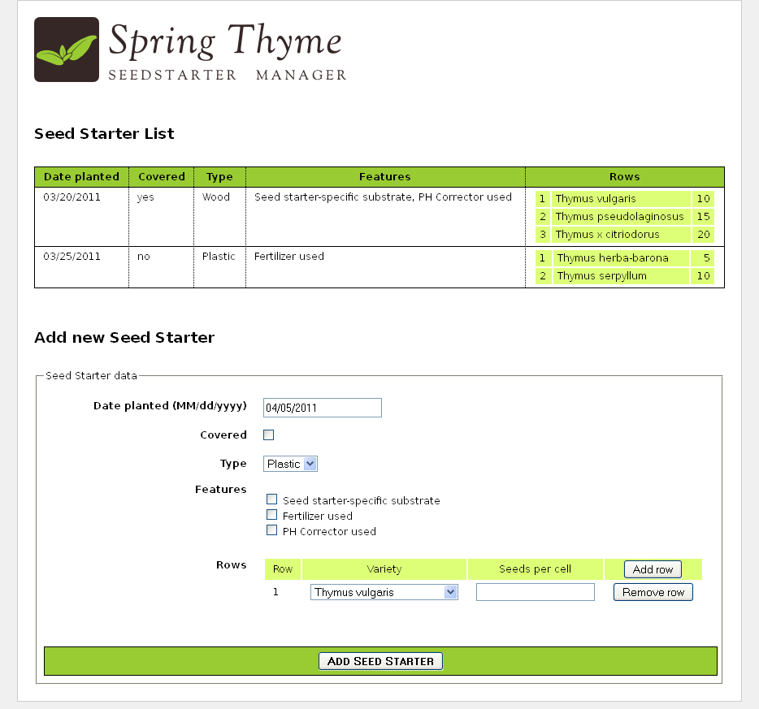
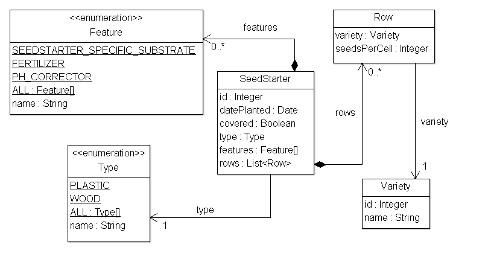

[[spring-thyme-seed-starter-manager]]
= Spring Thyme Seed Starter Manager
Doc Writer <tequlia2pop@gmail.com>
:toc: left
:homepage: http://www.thymeleaf.org/doc/tutorials/3.0/thymeleafspring.html#spring-thyme-seed-starter-manager

本指南中该章和后面章节中所示的示例的源代码可以在 https://github.com/thymeleaf/thymeleafexamples-stsm[Spring Thyme Seed Starter Manager GitHub 仓库] 中找到。

[[the-concept]]
== 概念

At Thymeleaf we’re huge fans of thyme, and every spring we prepare our seed starting kits with good soil and our favourite seeds, place them under the Spanish sun and patiently wait for our new plants to grow.

But this year we got fed up with sticking labels to the seed starter containers for knowing which seed was in each cell of the container, so we decided to prepare an application using Spring MVC and Thymeleaf to help us catalogue our starters: __The Spring Thyme SeedStarter Manager__.

.STSM front page

以类似于我们在 __使用 Thymeleaf 教程__中开发的 Good Thymes Virtual Grocery 应用程序，STSM 将举例说明集成 Thymeleaf 作为 Spring MVC 的模板引擎的最重要的方面。

[[business-layer]]
== 业务层

我们的应用程序需要一个非常简单的业务层。 首先，让我们看看我们的模型实体：

.STSM model

一些非常简单的服务类提供了所需的业务方法。例如：

[source,java,indent=0]
[subs="verbatim,quotes"]
----
@Service
public class SeedStarterService {

    @Autowired
    private SeedStarterRepository seedstarterRepository; 

    public List<SeedStarter> findAll() {
        return this.seedstarterRepository.findAll();
    }

    public void add(final SeedStarter seedStarter) {
        this.seedstarterRepository.add(seedStarter);
    }

}
----

以及：

[source,java,indent=0]
[subs="verbatim,quotes"]
----
@Service
public class VarietyService {

    @Autowired
    private VarietyRepository varietyRepository; 

    public List<Variety> findAll() {
        return this.varietyRepository.findAll();
    }

    public Variety findById(final Integer id) {
        return this.varietyRepository.findById(id);
    }

}
----

[[spring-mvc-configuration]]
== Spring MVC 配置

接下来，我们需要为应用程序设置 Spring MVC 配置，它不仅包括了标准的 Spring MVC 构件（如资源处理或注解扫描），还包括了模板引擎和视图解析器实例的创建。

[source,java,indent=0]
[subs="verbatim,quotes"]
----
@Configuration
@EnableWebMvc
@ComponentScan
public class SpringWebConfig
        extends WebMvcConfigurerAdapter implements ApplicationContextAware {

    private ApplicationContext applicationContext;

    public SpringWebConfig() {
        super();
    }

    public void setApplicationContext(final ApplicationContext applicationContext)
            throws BeansException {
        this.applicationContext = applicationContext;
    }

    /* ******************************************************************* */
    /*  GENERAL CONFIGURATION ARTIFACTS                                    */
    /*  Static Resources, i18n Messages, Formatters (Conversion Service)   */
    /* ******************************************************************* */

    @Override
    public void addResourceHandlers(final ResourceHandlerRegistry registry) {
        super.addResourceHandlers(registry);
        registry.addResourceHandler("/images/**").addResourceLocations("/images/");
        registry.addResourceHandler("/css/**").addResourceLocations("/css/");
        registry.addResourceHandler("/js/**").addResourceLocations("/js/");
    }

    @Bean
    public ResourceBundleMessageSource messageSource() {
        ResourceBundleMessageSource messageSource = new ResourceBundleMessageSource();
        messageSource.setBasename("Messages");
        return messageSource;
    }

    @Override
    public void addFormatters(final FormatterRegistry registry) {
        super.addFormatters(registry);
        registry.addFormatter(varietyFormatter());
        registry.addFormatter(dateFormatter());
    }

    @Bean
    public VarietyFormatter varietyFormatter() {
        return new VarietyFormatter();
    }

    @Bean
    public DateFormatter dateFormatter() {
        return new DateFormatter();
    }

    /* **************************************************************** */
    /*  THYMELEAF-SPECIFIC ARTIFACTS                                    */
    /*  TemplateResolver <- TemplateEngine <- ViewResolver              */
    /* **************************************************************** */

    @Bean
    public SpringResourceTemplateResolver templateResolver(){
        // SpringResourceTemplateResolver automatically integrates with Spring's own
        // resource resolution infrastructure, which is highly recommended.
        SpringResourceTemplateResolver templateResolver = new SpringResourceTemplateResolver();
        templateResolver.setApplicationContext(this.applicationContext);
        templateResolver.setPrefix("/WEB-INF/templates/");
        templateResolver.setSuffix(".html");
        // HTML is the default value, added here for the sake of clarity.
        templateResolver.setTemplateMode(TemplateMode.HTML);
        // Template cache is true by default. Set to false if you want
        // templates to be automatically updated when modified.
        templateResolver.setCacheable(true);
        return templateResolver;
    }

    @Bean
    public SpringTemplateEngine templateEngine(){
        // SpringTemplateEngine automatically applies SpringStandardDialect and
        // enables Spring's own MessageSource message resolution mechanisms.
        SpringTemplateEngine templateEngine = new SpringTemplateEngine();
        templateEngine.setTemplateResolver(templateResolver());
        // Enabling the SpringEL compiler with Spring 4.2.4 or newer can
        // speed up execution in most scenarios, but might be incompatible
        // with specific cases when expressions in one template are reused
        // across different data types, so this flag is "false" by default
        // for safer backwards compatibility.
        templateEngine.setEnableSpringELCompiler(true);
        return templateEngine;
    }

    @Bean
    public ThymeleafViewResolver viewResolver(){
        ThymeleafViewResolver viewResolver = new ThymeleafViewResolver();
        viewResolver.setTemplateEngine(templateEngine());
        return viewResolver;
    }

}
----

[[the-controller]]
== 控制器

当然，我们的应用程序还需要一个控制器。 因为 STSM 只包含一个网页（显示种子启动器列表和添加新启动器的表单），所以我们只需为所有服务器交互编写一个控制器类：

[source,java,indent=0]
[subs="verbatim,quotes"]
----
@Controller
public class SeedStarterMngController {

    @Autowired
    private VarietyService varietyService;
    
    @Autowired
    private SeedStarterService seedStarterService;

    ...

}
----

现在让我们看看我们可以为这个控制器类添加什么内容。

[[model-attributes]]
=== 模型属性（Model Attributes）

首先，我们将在页面中添加一些模型属性：

[source,java,indent=0]
[subs="verbatim,quotes"]
----
@ModelAttribute("allTypes")
public List<Type> populateTypes() {
    return Arrays.asList(Type.ALL);
}
    
@ModelAttribute("allFeatures")
public List<Feature> populateFeatures() {
    return Arrays.asList(Feature.ALL);
}
    
@ModelAttribute("allVarieties")
public List<Variety> populateVarieties() {
    return this.varietyService.findAll();
}
    
@ModelAttribute("allSeedStarters")
public List<SeedStarter> populateSeedStarters() {
    return this.seedStarterService.findAll();
}
----

[[mapped-methods]]
=== 映射方法（Mapped methods）

现在是控制器最重要的部分，映射方法：一个用于显示表单页面，另一个用于处理添加新的 `SeedStarter` 对象。

[source,java,indent=0]
[subs="verbatim,quotes"]
----
@RequestMapping({"/","/seedstartermng"})
public String showSeedstarters(final SeedStarter seedStarter) {
    seedStarter.setDatePlanted(Calendar.getInstance().getTime());
    return "seedstartermng";
}

@RequestMapping(value="/seedstartermng", params={"save"})
public String saveSeedstarter(
        final SeedStarter seedStarter, final BindingResult bindingResult, final ModelMap model) {
    if (bindingResult.hasErrors()) {
        return "seedstartermng";
    }
    this.seedStarterService.add(seedStarter);
    model.clear();
    return "redirect:/seedstartermng";
}
----

[[configuring-a-conversion-service]]
== Configuring a Conversion Service