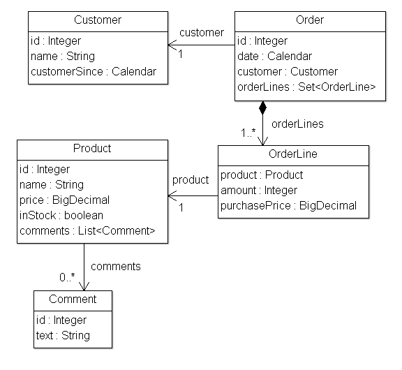
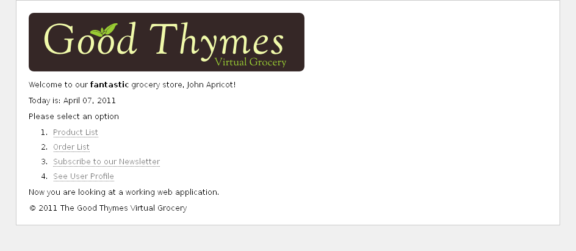

[[the-good-thymes-virtual-grocery]]
= 使用 Thymeleaf 创建一个虚拟的杂货店
Doc Writer <tequlia2pop@gmail.com>
:toc: left
:homepage: http://www.thymeleaf.org/doc/tutorials/3.0/usingthymeleaf.html#introducing-thymeleaf

本章以及指南中后面章节展示的示例的源代码可以在 https://github.com/thymeleaf/thymeleafexamples-gtvg[Good Thymes Virtual Grocery GitHub 仓库] 中找到。

[[a-website-for-a-grocery]]
== 杂货店的网站

为了更好地解释使用 Thymeleaf 处理模板中涉及的概念，本教程将使用一个演示应用程序，您可以从项目网站上下载。

这个应用程序是一个假想的虚拟杂货店网站，并将为我们提供很多场景来展示Thymeleaf的许多功能。

首先，我们需要一个简单的模型实体集合：通过创建 Orders 将 Products 销售给 Customers。 我们还将管理关于这些 Products 的 Comments：

.示例应用程序模型

我们的应用程序也将有一个非常简单的服务层，由Service对象组成，包含如下方法：

[source,java,indent=0]
[subs="verbatim,quotes"]
----
public class ProductService {

    ...

    public List<Product> findAll() {
        return ProductRepository.getInstance().findAll();
    }

    public Product findById(Integer id) {
        return ProductRepository.getInstance().findById(id);
    }
    
}
----

在web层，我们的应用程序将有一个过滤器，它将根据请求URL将执行委派给启用Thymeleaf的命令。

[source,java,indent=0]
[subs="verbatim,quotes"]
----
private boolean process(HttpServletRequest request, HttpServletResponse response)
        throws ServletException {
    
    try {

        // 防止引擎执行对资源URL的处理
        if (request.getRequestURI().startsWith("/css") ||
                request.getRequestURI().startsWith("/images") ||
                request.getRequestURI().startsWith("/favicon")) {
            return false;
        }

        
        /*
         * 查询控制器/URL映射，并获取将处理请求的控制器。 如果没有控制器可用，返回false并让其他过滤器/servlet来处理请求。
         */
        IGTVGController controller = this.application.resolveControllerForRequest(request);
        if (controller == null) {
            return false;
        }

        /*
         * 获得 TemplateEngine 实例。
         */
        ITemplateEngine templateEngine = this.application.getTemplateEngine();

        /*
         * 编写响应头
         */
        response.setContentType("text/html;charset=UTF-8");
        response.setHeader("Pragma", "no-cache");
        response.setHeader("Cache-Control", "no-cache");
        response.setDateHeader("Expires", 0);

        /*
         * 执行控制器和处理视图模板，将结果写入响应 writer。
         */
        controller.process(
                request, response, this.servletContext, templateEngine);
        
        return true;
        
    } catch (Exception e) {
        try {
            response.sendError(HttpServletResponse.SC_INTERNAL_SERVER_ERROR);
        } catch (final IOException ignored) {
            // 忽略
        }
        throw new ServletException(e);
    }
    
}
----

这是我们的IGTVGController接口：

[source,java,indent=0]
[subs="verbatim,quotes"]
----
public interface IGTVGController {

    public void process(
            HttpServletRequest request, HttpServletResponse response,
            ServletContext servletContext, ITemplateEngine templateEngine);    
    
}
----

我们现在要做的是创建 `IGTVGController` 接口的实现，从服务检索数据和使用 `ITemplateEngine` 对象处理模板。

最后，它将看起来像这样：

.示例应用程序主页

但首先让我们看看如何初始化模板引擎。

[[creating-and-configuring-the-template-engine]]
== 创建和配置模板引擎

过滤器中的 `process(…) `方法包含这一行：

[source,java,indent=0]
[subs="verbatim,quotes"]
----
ITemplateEngine templateEngine = this.application.getTemplateEngine();
----

这意味着GTVGApplication类负责创建和配置Thymeleaf应用程序中最重要的对象之一：TemplateEngine实例（实现ITemplateEngine接口）。

我们的 `org.thymeleaf.TemplateEngine` 对象初始化如下：

[source,java,indent=0]
[subs="verbatim,quotes"]
----
public class GTVGApplication {
  
    
    ...
    private static TemplateEngine templateEngine;
    ...
    
    
    public GTVGApplication(final ServletContext servletContext) {

        super();

        ServletContextTemplateResolver templateResolver = 
                new ServletContextTemplateResolver(servletContext);
        
        // HTML是默认模式，但为了更好地理解代码我们仍将设置它
        templateResolver.setTemplateMode(TemplateMode.HTML);
        // 这将把 "home" 转换为 "/WEB-INF/templates/home.html"
        templateResolver.setPrefix("/WEB-INF/templates/");
        templateResolver.setSuffix(".html");
        // 将模板缓存TTL设置为1小时。 如果未设置，条目将始终存储在缓存中，直到被LRU驱逐
        templateResolver.setCacheTTLMs(Long.valueOf(3600000L));
        
        // 默认情况下，缓存设置为true。 如果希望模板在修改时自动更新，请设置为false。
        templateResolver.setCacheable(true);
        
        this.templateEngine = new TemplateEngine();
        this.templateEngine.setTemplateResolver(templateResolver);
        
        ...

    }

}
----

有很多方法来配置 `TemplateEngine` 对象，但是这几行代码教给我们的步骤已经足够了。

[[the-template-resolver]]
=== The Template Resolver

让我们从模板解析器开始：

[source,java,indent=0]
[subs="verbatim,quotes"]
----
ServletContextTemplateResolver templateResolver = 
        new ServletContextTemplateResolver(servletContext);
----

模板解析器是实现了 Thymeleaf API 的 `org.thymeleaf.templateresolver.ITemplateResolver` 接口的对象：

[source,java,indent=0]
[subs="verbatim,quotes"]
----
public interface ITemplateResolver {

    ...
  
    /*
     * 通过模板名称（或内容）以及（可选的）所有者模板来解析模板，以防我们尝试解析另一个模板的片段。 如果模板无法由此模板解析器处理，则返回null。
     */
    public TemplateResolution resolveTemplate(
            final IEngineConfiguration configuration,
            final String ownerTemplate, final String template,
            final Map<String, Object> templateResolutionAttributes);
}
----

这些对象负责确定模板如何访问，在这个 GTVG 应用程序中，`org.thymeleaf.templateresolver.ServletContextTemplateResolver` 意味着我们将从 __Servlet 上下文__ 中将我们的模板文件作为资源来检索。Servlet 上下文是一个应用程序范围的 `javax.servlet.ServletContext` 对象，它存在于每个 Java Web 应用程序中，并从 Web 应用程序的根目录解析资源。

但这不是模板解析器的全部，因为我们可以设置一些配置参数。 首先是模板模式：

[source,java,indent=0]
[subs="verbatim,quotes"]
----
templateResolver.setTemplateMode(TemplateMode.HTML);
----

HTML 是 `ServletContextTemplateResolver` 默认的模板模式，但是明确地定义模板模式是很好的做法，这使我们的代码清楚地记录发生的事情。

[source,java,indent=0]
[subs="verbatim,quotes"]
----
templateResolver.setPrefix("/WEB-INF/templates/");
templateResolver.setSuffix(".html");
----

使用 __prefix__ 和 __suffix__ 来修改模板名称，我们会将最终的模板名称传递给引擎以获取实际要使用的的资源名称。

使用此配置，模板名称 __“product/list”__ 将对应于：

[source,java,indent=0]
[subs="verbatim,quotes"]
----
servletContext.getResourceAsStream("/WEB-INF/templates/product/list.html")
----

模板解析器可以通过 `cacheTTLMs` 属性，来配置解析后的模板可以在缓存中存活的时间量。这是可选的。

[source,java,indent=0]
[subs="verbatim,quotes"]
----
templateResolver.setCacheTTLMs(3600000L);
----

当达到最大的缓存大小时，如果模板是当前缓存的最旧条目，则仍然会从缓存中删除，不管它存活的时间有没有达到 TTL。

====
用户可以通过实现 `ICacheManager` 接口或通过修改 `StandardCacheManager` 对象定义缓存的行为和大小，`StandardCacheManager` 对象负责管理默认的缓存来。
====

模板解析器还有很多要了解的内容，但现在让我们先看看模板引擎对象的创建。

[[the-template-engine]]
=== The Template Engine

模板引擎对象是 `org.thymeleaf.ITemplateEngine` 接口的实现。 其中一个实现由 Thymeleaf 核心提供：`org.thymeleaf.TemplateEngine`，我们在这里创建一个它的实例：

[source,java,indent=0]
[subs="verbatim,quotes"]
----
templateEngine = new TemplateEngine();
templateEngine.setTemplateResolver(templateResolver);
----

相当简单，不是吗？ 我们需要的是创建一个实例并为它设置模板解析器。

模板解析器是 `TemplateEngine` 唯一需要的__必需__参数，虽然有很多被覆盖的其他的属性（消息解析器，缓存大小等）。 现在，这就是我们需要的。

我们的模板引擎现在准备好了，我们可以开始使用 Thymeleaf 创建我们的页面。